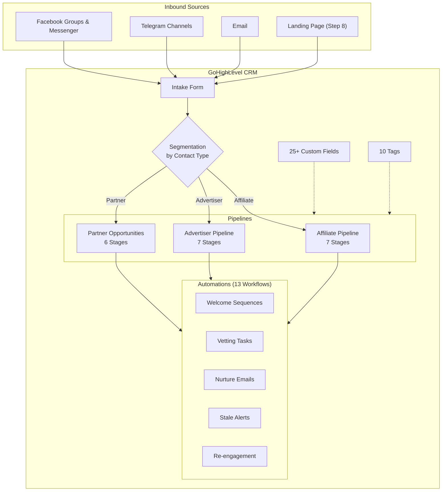
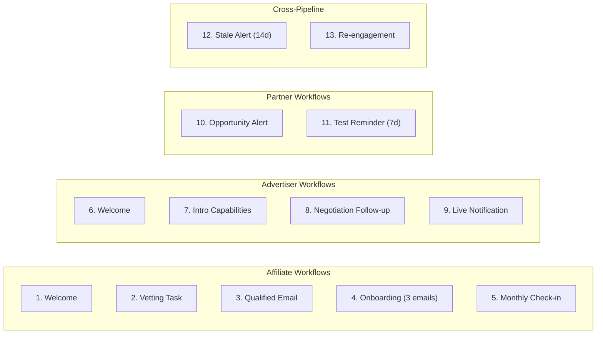
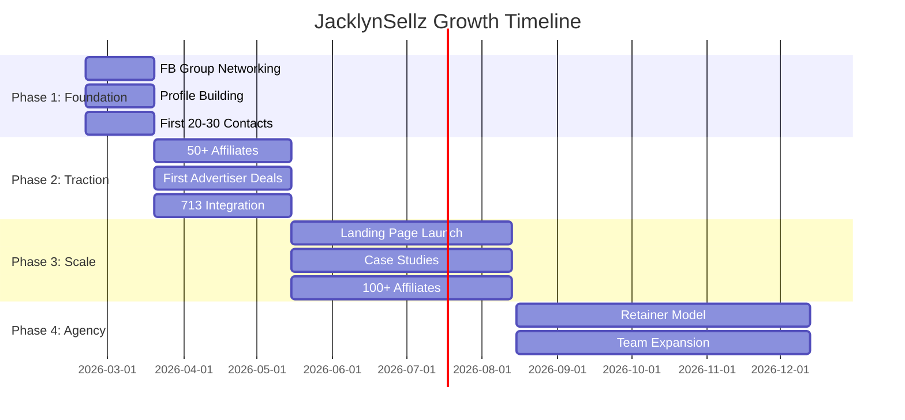

# JacklynSellz — Project Overview

> A GoHighLevel-based affiliate network system for attracting, organizing, and scaling relationships with affiliates, advertisers, and strategic partners — with a path toward a boutique marketing agency.

---

## System Architecture



---

## Deliverables Summary

| # | Document | Purpose | Key Contents |
|---|----------|---------|--------------|
| 1 | [product-marketing-context.md](file:///Users/uxie/Documents/Vibe%20Code/JacklynSellz/.claude/product-marketing-context.md) | Brand foundation | Positioning, personas, voice, competitive landscape, proof points |
| 2 | [ghl-system-design.md](file:///Users/uxie/Documents/Vibe%20Code/JacklynSellz/docs/plans/2026-02-19-ghl-system-design.md) | Design exploration | 3 approaches evaluated → Approach 2 (Full Spec) selected |
| 3 | [pipeline-and-referral-design.md](file:///Users/uxie/Documents/Vibe%20Code/JacklynSellz/docs/plans/pipeline-and-referral-design.md) | Pipeline architecture | 3 pipelines, custom fields, incentive structures, tags |
| 4 | [email-sms-copy-templates.md](file:///Users/uxie/Documents/Vibe%20Code/JacklynSellz/docs/plans/email-sms-copy-templates.md) | Marketing copy | 14 emails + 4 SMS with psychology annotations |
| 5 | [ghl-setup-guide.md](file:///Users/uxie/Documents/Vibe%20Code/JacklynSellz/docs/plans/ghl-setup-guide.md) | GHL configuration | Step-by-step setup: fields, tags, pipelines, workflows, forms |
| 6 | [growth-strategy.md](file:///Users/uxie/Documents/Vibe%20Code/JacklynSellz/docs/plans/growth-strategy.md) | Growth plan | 4-phase strategy from foundation to agency model |
| 7 | [landing-page-design-system.md](file:///Users/uxie/Documents/Vibe%20Code/JacklynSellz/docs/plans/landing-page-design-system.md) | Design system | Colors, typography, page pattern, quality checklist |

---

## Pipeline Architecture

### Affiliate Pipeline (7 Stages)
```
New Contact → Vetting → Qualified → Approved → Active → Scaling → VIP
```

### Advertiser Pipeline (7 Stages)
```
New Prospect → Intro → Review → Negotiation → Live → Scaling → Strategic
```

### Partner Opportunities Pipeline (6 Stages)
```
Identified → Matching → Testing → Live → Scaling → Archived
```

---

## Custom Fields (25 total)

### Contact Fields (10) — Settings → Custom Fields → Contact
| Category | Fields | Example |
|----------|--------|---------|
| **General** (4) | Contact Type, Referred By, Source Group, Notes | Contact Type = `Affiliate` |
| **Affiliate** (5) | Niche, Experience Level, Traffic Sources, Monthly Volume, Vetting Status | Monthly Volume = `$5K-$25K` |
| **Advertiser** (1) | Company Name | Company Name = `HealthMax Inc` |

### Opportunity Fields (15) — Settings → Custom Fields → Opportunity
| Category | Fields | Example |
|----------|--------|---------|
| **Advertiser Deal** (8) | Offer Type, Offer Vertical, Payout Range, GEO Targets, Exclusivity, Contract Status, Landing Page URL, Deal Notes | Offer Type = `CPA` |
| **Partner Deal** (7) | Opportunity Name, Affiliates Involved, Advertiser Involved, Deal Type, Estimated Value, Start Date, Status Notes | Deal Type = `Lead Gen` |

---

## Automations (13 Workflows)



| # | Name | Type | Trigger |
|---|------|------|---------|
| 1 | Affiliate Welcome | Email + SMS + Alert | Enters "New Contact" |
| 2 | Vetting Task | Internal Task | Enters "Vetting" |
| 3 | Qualified Notification | Email + SMS | Enters "Qualified" |
| 4 | Onboarding Sequence | 3 Emails (Day 1, 3, 5) | Enters "Approved" |
| 5 | Monthly Check-in | Recurring Email | Enters "Active" + 30 days |
| 6 | Advertiser Welcome | Email + SMS + Alert | Enters "New Prospect" |
| 7 | Intro Capabilities | Email | Enters "Intro" |
| 8 | Negotiation Follow-up | Email + Task | Enters "Negotiation" |
| 9 | Live Notification | Internal Alert | Enters "Live" |
| 10 | Opportunity Alert | Internal Alert | Enters "Identified" |
| 11 | Test Reminder | Internal Reminder | 7 days in "Testing" |
| 12 | Stale Contact Alert | Tag + Alert | No change for 14 days |
| 13 | Re-engagement | Email + SMS | Tagged "stale" for 7 days |

---

## Email & SMS Copy

| Type | Count | Psychology Applied |
|------|-------|--------------------|
| **Emails** | 14 | Reciprocity, Commitment, Social Proof, Authority, Loss Aversion, Zeigarnik Effect |
| **SMS** | 4 | Short, personal, direct |

---

## Growth Strategy (4 Phases)



---

## Landing Page Design System

| Element | Choice |
|---------|--------|
| **Pattern** | Hero + Problem + Solution + Testimonials + CTA |
| **Style** | Trust & Authority |
| **Primary Color** | `#0F766E` (Teal) |
| **CTA Color** | `#0369A1` (Blue) |
| **Background** | `#F0FDFA` (Light Teal) |
| **Heading Font** | Lexend |
| **Body Font** | Source Sans 3 |

---

## Manual Build Order

| Step | What to Build | Where in GHL | Est. Time |
|------|--------------|-------------|-----------|
| 1A | Contact Fields (10) | Settings → Custom Fields → **Contact** | ~10 min |
| 1B | Opportunity Fields (15) | Settings → Custom Fields → **Opportunity** | ~10 min |
| 2 | Tags (10) | Settings → Tags | ~5 min |
| 3 | Pipelines (3 with 20 stages) | Opportunities → Pipelines | ~10 min |
| 4 | Intake Form | Sites → Forms | ~10 min |
| 5 | Workflows (13) | Automation → Workflows | ~1-2 hrs |
| 6 | Test everything | — | ~20 min |

> **Total estimated setup time: ~2-3 hours**

> ⚠️ **Important:** In Step 1, create Contact fields and Opportunity fields in separate locations in GHL Settings. Contact fields live at `Settings → Custom Fields → Contact`, Opportunity fields at `Settings → Custom Fields → Opportunity`.

---

## Skills Used

| Skill | Applied To |
|-------|-----------|
| `product-marketing-context` | Brand positioning document |
| `brainstorming` | Design exploration & approach selection |
| `referral-program` | Pipeline architecture & incentive design |
| `copywriting` | Email/SMS templates |
| `marketing-psychology` | Conversion principles in copy |
| `code-documentation` | GHL setup guide |
| `marketing-ideas` | Growth strategy |
| `ui-ux-pro-max` | Landing page design system |

---

## What's Next

- [ ] **Now:** Build GHL system using [ghl-setup-guide.md](file:///Users/uxie/Documents/Vibe%20Code/JacklynSellz/docs/plans/ghl-setup-guide.md) (start with custom fields)
- [ ] **Step 8:** Landing page build (HTML/CSS/JS) — ready when you are
- [ ] **Phase 1:** Jackie starts networking in FB groups
